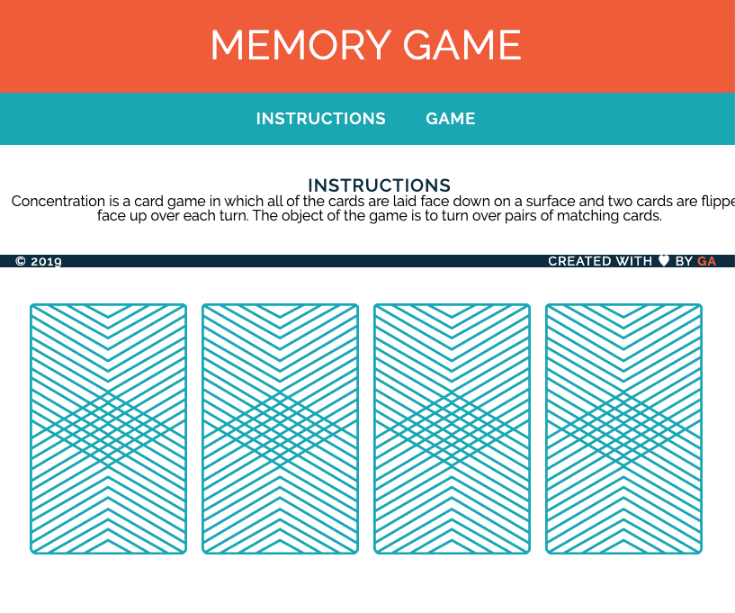

# memory_game

### Overview
A very simple memory game using just 4 cards in fixed positions.

Card flipping in JS is achieved using `addEventListener('click')` and `setAttribute('src')`.

### Screen Shot

